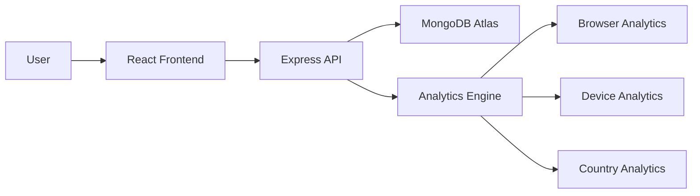

# SmartURL Analytics Platform

## 🚀 Project Overview

SmartURL Analytics Platform is a modern SaaS-style URL shortening and analytics application that allows users to create short links and track their performance through an interactive analytics dashboard.

The platform provides detailed insights including click tracking, browser statistics, device analytics, country-wise analytics, and URL performance monitoring. The project is designed with a modern UI and focuses on delivering real-time analytics in an intuitive and visually appealing manner.

---
## 🔗 Repository

GitHub:
https://github.com/YazhiniRaja-24/SmartURL-Analytics-Platform-URL-Shortener-Analytics-Dashboard-

## 🎯 Problem Statement

Traditional URL shortening services provide limited visibility into how links perform after they are shared.

Users often need answers to questions such as:

* How many times was a link clicked?
* Which browsers are users using?
* Which devices generate the most traffic?
* Which countries generate the highest engagement?
* Which URLs perform best?

SmartURL solves these challenges by combining URL shortening with a comprehensive analytics dashboard.

---

## 💡 Solution

SmartURL provides:

* Secure URL shortening
* Analytics tracking for each shortened URL
* Browser usage insights
* Device usage insights
* Country-wise traffic monitoring
* Interactive dashboard with charts
* User authentication and profile management
* Modern responsive user interface

---

# ✨ Features

### URL Management

* Create shortened URLs
* Custom short codes
* Manage generated URLs
* View URL details

### Analytics Dashboard

* Total Clicks Tracking
* Total URLs Created
* Active URLs Monitoring
* Top Performing URLs

### Analytics Reports

* Browser Analytics
* Device Analytics
* Country Analytics
* Click Trend Analysis

### User Features

* User Authentication
* Login and Registration
* User Profile Management

### UI Features

* Dark Mode Design
* SaaS Inspired Dashboard
* Responsive Layout
* Interactive Charts
* Modern Navigation

---

# 🛠️ Tech Stack

## Frontend

* React.js
* Vite
* Tailwind CSS
* React Router
* Framer Motion
* Recharts

## Backend

* Node.js
* Express.js

## Database

* MongoDB Atlas

## Tools

* Git
* GitHub
* Render
* Vercel
* Postman

---

# 📋 AI Planning Document

## 1. Requirement Analysis

The application was planned to solve URL shortening and analytics tracking problems while providing a professional dashboard experience.

Primary requirements:

* URL shortening
* Analytics tracking
* Dashboard visualization
* User authentication
* Responsive UI

---

## 2. UI Planning

The UI was designed with:

* Dark theme
* Glassmorphism cards
* Sidebar navigation
* Interactive charts
* Responsive design

Design goals:

* Modern SaaS appearance
* Easy navigation
* Clean analytics visualization

---

## 3. Database Planning

Collections planned:

### Users

```json
{
  "_id": "userId",
  "name": "John Doe",
  "email": "john@example.com",
  "password": "hashedPassword"
}
```

### URLs

```json
{
  "_id": "urlId",
  "originalUrl": "https://google.com",
  "shortCode": "abc123",
  "clickCount": 10
}
```

### Analytics

```json
{
  "_id": "analyticsId",
  "urlId": "urlId",
  "browser": "Chrome",
  "device": "Desktop",
  "country": "India"
}
```

---

## 4. API Planning

Endpoints planned:

### Authentication

* POST /api/auth/register
* POST /api/auth/login

### URL

* POST /api/url/create
* GET /api/url/list

### Analytics

* GET /api/analytics
* GET /api/browser
* GET /api/device
* GET /api/country

---

## 5. Dashboard Planning

Dashboard includes:

* Total URLs
* Total Clicks
* Active Links
* Analytics Charts
* Top Performing URLs

---

## 6. Testing Strategy

Testing included:

* API testing using Postman
* Database verification
* URL redirection testing
* Analytics validation
* UI responsiveness testing

---

# 🏗️ System Architecture



---

# 📂 Project Structure

```text
SmartURL
│
├── SmartURL-frontend
│   ├── src
│   ├── public
│   └── package.json
│
├── SmartURL-backend
│   ├── controllers
│   ├── routes
│   ├── models
│   ├── middleware
│   ├── config
│   └── server.js
│
├── screenshots
├── README.md
├── .gitignore
└── .env.example
```

---

# ⚙️ Setup Instructions

## Clone Repository

```bash
git clone https://github.com/YazhiniRaja-24/SmartURL-Analytics-Platform-URL-Shortener-Analytics-Dashboard-.git
```

## Backend Setup

```bash
cd server
npm install
npm run dev
```

## Frontend Setup

```bash
cd client
npm install
npm run dev
```

---

# 🔐 Environment Variables

Create a .env file inside server folder.

```env
PORT=5000
MONGO_URI=your_mongodb_connection_string
JWT_SECRET=your_secret_key
BASE_URL=http://localhost:5000
```

---

# 📝 Assumptions Made

* Users have internet access.
* MongoDB Atlas database is available.
* Browser supports modern JavaScript features.
* Analytics are recorded only when users access shortened URLs.
* User authentication is required for dashboard access.
* Vercel is used for frontend deployment.
* Render is used for backend deployment.

---

# 📊 Sample Outputs

### Dashboard Metrics

* Total URLs Created
* Total Clicks
* Active URLs
* Analytics Reports

### Analytics Reports

* Browser Distribution
* Device Distribution
* Country Distribution
* Click Trend Analysis

---

# 🗄️ Sample Database Entries

```json
{
  "originalUrl": "https://google.com",
  "shortCode": "abc123",
  "clickCount": 15
}
```

```json
{
  "browser": "Chrome",
  "device": "Desktop",
  "country": "India"
}
```

---

# 📸 Screenshots

Add screenshots in this section.

### Login Page


### Dashboard


### Analytics


### URL Management


---
# 🌐 Live Deployment

Frontend:
(Add Vercel URL here)

Backend API:
(Add Render URL here)
# 🎥 Demo Video

YouTube Demo:

https://youtu.be/nKlLWyoJ_Hg

---

# 🚀 Future Enhancements

* QR Code Generation
* Real-time Analytics
* Export Reports
* Team Collaboration
* Advanced Filters
* AI-powered Analytics Insights

---

# 📚 Learning Outcomes

Through this project, the following concepts were learned and implemented:

* MERN Stack Development
* REST API Development
* MongoDB Integration
* Authentication & Authorization
* Analytics Tracking
* Data Visualization
* Responsive UI Design
* Git & GitHub Workflow
* Deployment using Render and Vercel

---

# 👩‍💻 Developer

**Yazhini Raja**

Final Year BE CSE Student

---

# ✅ Conclusion

SmartURL Analytics Platform successfully combines URL shortening with advanced analytics tracking and dashboard visualization. The project demonstrates full-stack development skills, database management, API integration, analytics processing, and modern UI design.

---

This project is a part of a hackathon run by https://katomaran.com this readme is oky?? or want to change anything